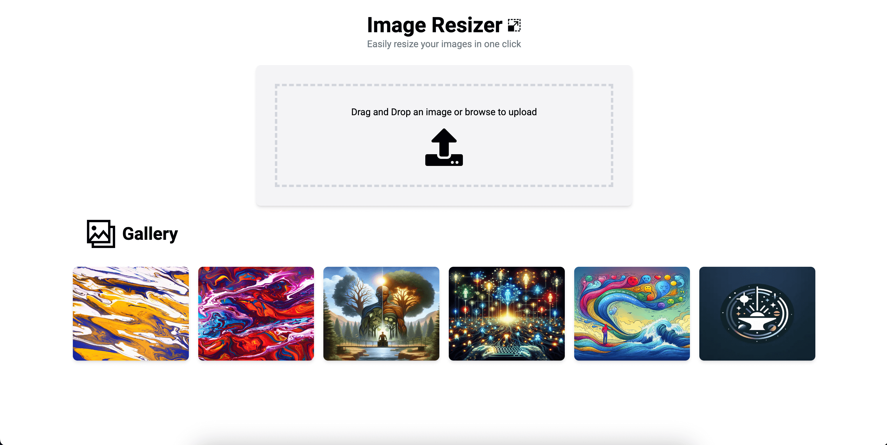

## Image Resizer



For a live preview of the application, visit the demo by following this link:

[View Demo Application](http://3.236.218.18:3000/)

# Terraform Infrastructure Setup Guide

This guide walks you through the steps to create an AWS infrastructure using Terraform and setup a development environment, starting with the creation of a Terraform agent within your AWS account

## Prerequisites

- AWS Account
- IAM user with sufficient permissions to create resources
- [Terraform](https://www.terraform.io/downloads.html) installed locally (version 1.0 or later)
- [AWS CLI](https://docs.aws.amazon.com/cli/latest/userguide/install-cliv2.html) installed and configured

## Step 1: Configure AWS Credentials

To configure AWS credentials, follow these steps to set up your environment so that Terraform can access and manage your AWS resources:

1. **Install and Configure AWS CLI**:
   Ensure that the AWS CLI is installed on your local machine. You can verify the installation by running:

   ```bash
   aws --version
   ```

2. **Configure AWS CLI with Your Credentials**:
   Configure AWS CLI with Your Credentials: Run the following command to set up your AWS access keys:

   ```bash
   aws configure
   ```

   You will be prompted to enter your AWS credentials:

   ```bash
   AWS Access Key ID: Your IAM user's access key ID.
   AWS Secret Access Key: Your IAM user's secret access key.
   ```

## Step 2: Run Terraform Steps

Follow these steps to initialize, plan, and apply your Terraform configuration:

1. **Navigate to Your Terraform Configuration Directory**:
   Change to the terraform directory or other Terraform configuration files are located:
   ```bash
   cd /.iac/terraform
   ```
2. **Initialize Terraform**:
   Run the following command to initialize Terraform. This step downloads the required provider plugins and sets up the working directory:
   ```bash
   terraform init
   ```
3. **Plan the Infrastructure Changes**:
   Generate and review an execution plan to see the changes that Terraform will make:

   ```bash
   terraform plan
   ```

4. **Apply the Changes**:
   Apply the planned changes to create or update your infrastructure:

   ```bash
   terraform apply
   ```

## Step 3: Create and Manage Workspaces and Environments

Terraform workspaces allow you to maintain multiple states for the same configuration. This is useful for environments such as staging and production.

1. **Create the Staging Workspace**:
   Run the following command to create a workspace for the staging environment:

   ```bash
   terraform workspace new staging

   ```

2. **Create the Production Workspace**:
   Run the following command to create a workspace for the staging environment:

   ```bash
   terraform workspace new production
   ```

3. **Switch Between Workspaces**:
   To switch to a specific workspace, use the following command:

   ```bash
   terraform workspace select staging
   ```

   or

   ```bash
   terraform workspace select production
   ```

4. **Apply Changes Using .tfvars Files**:
   When you have environment-specific variable files (e.g., stg.tfvars and prd.tfvars)

   Plan and Apply with a .tfvars File: Run the plan command with the -var-file flag to preview the changes:

   ```bash
   terraform plan -var-file="env.tfvars"
   ```

   and

   ```bash
   terraform apply -var-file="env.tfvars"
   ```

## Step 4: Development Environment Setup

Once Terraform has been applied and an IAM user with access keys has been created, you can set up a development environment.

1. **Duplicate the `.env.template` file to store environment variable placeholders**:
   Populate the .env File: Fill in the .env.local file with the IAM access keys and other environment variables created by Terraform:

   ```bash
      AWS_ACCESS_KEY_ID=
      AWS_SECRET_ACCESS_KEY=
      AWS_REGION=
      S3_BUCKET_NAME=
   ```

2. **Build and Run**:
   Use the following command to build and start your local development:

   ```bash
   npm run dev
   # or
   yarn dev
   # or
   pnpm dev
   # or
   bun dev
   ```

3. **Build and Run with Docker Compose**:
   Use the following command to build and start your Docker container:

   ```bash
   docker-compose --env-file .env.local up --build

   ```

## Design Choices and Known Limitations

### Next.js for the Image Resizer Application

Next.js was chosen for this project due to its powerful features that make it ideal for building a robust image resizer application using React and API routes. Below are the key reasons for selecting Next.js:

#### 1. **Full-Stack Capabilities**

Next.js supports both frontend and backend logic within a single codebase through its API routes. This means that the image processing logic using the AWS SDK can be seamlessly handled on the server side, while the React-based user interface provides an intuitive experience on the client side. This eliminates the need for separate backend services, simplifying project management and deployment.

#### 2. **API Routes Integration**

The built-in API routes feature in Next.js allows you to create backend endpoints effortlessly. This is perfect for creating and managing image processing operations through the AWS SDK, providing a streamlined way to handle server-side image manipulation and S3 interactions without setting up an entirely separate server.

#### 3. **Single Codebase for Frontend and Backend**

By using Next.js, the development team can maintain a single codebase that includes both frontend components and backend logic. This unified approach improves collaboration, simplifies code management, and accelerates development speed. It also ensures consistency across the application, as both frontend and backend logic are built using TypeScript.

#### 4. **Ease of Deployment**

Next.js can be deployed easily using any cloud service that supports Node.js, making it straightforward to deploy the application and integrate with AWS for further scalability.

### Amazon ECS as the Computing Solution

ECS was chosen as the computing solution to complement the Next.js application for the following reasons:

#### 1. **Scalability and Load Management**

ECS provides an efficient way to manage and scale containerized applications, which is crucial for handling potentially high volumes of image processing requests.

#### 2. **Seamless Integration with AWS Ecosystem**

ECS integrates natively with AWS services like S3, IAM, and CloudWatch. This simplifies the setup for managing image uploads, processing, and monitoring, aligning with the use of the AWS SDK within the Next.js API routes.

#### 3. **Containerization Benefits**

Deploying the Next.js application as a container on ECS provides the consistency and isolation benefits of containerization. This ensures that the application runs uniformly across different environments, reducing potential issues related to development-to-production discrepancies.

### Final Considerations and Next Steps

- **CI/CD Pipeline with GitHub Actions**: Implementing a CI/CD pipeline ensures automatic testing and deployment. This can be set up with GitHub Actions to build, test, and deploy the Next.js application seamlessly.
- **Unit Testing**: Incorporate a robust unit testing strategy using frameworks like Jest to ensure code reliability and maintain a high standard of quality.
